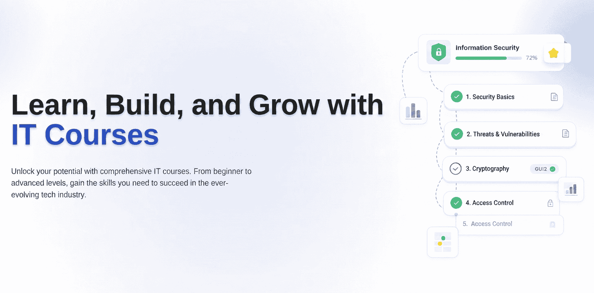

# IT Courses

**IT Courses** is an open-source platform for learning Information Technology through structured, concise, and practical courses.

The project is designed to make technical learning more organized and accessible, allowing users to explore courses divided into modules and lessons while keeping track of their progress.

## ✨ Features

* 📚 Courses organized into modules and lessons
* ✅ Lesson completion tracking
* ⭐ Favorite courses
* 💾 Progress and preferences stored locally in the browser
* 🌎 Multilingual support (English and Portuguese - Brazil)
* 📱 Responsive interface
* 🚀 Static-friendly architecture

## 🛠️ Tech Stack

* **Next.js**
* **Tailwind CSS**
* **TypeScript**

## 📄 License

This project is licensed under the **MIT License**.

See the [LICENSE](LICENSE) file for more information.
